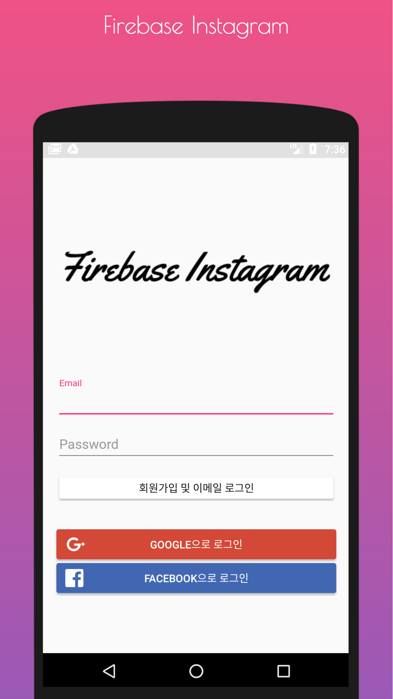
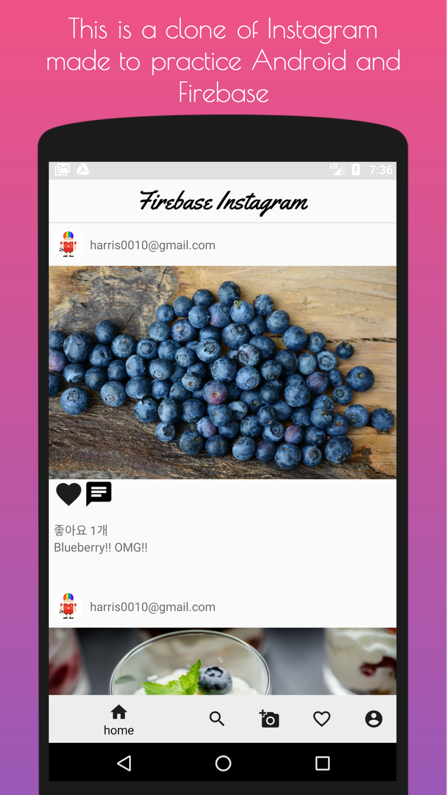
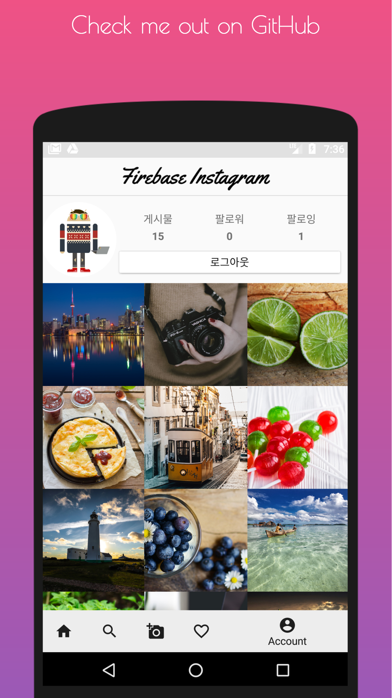

# Firebase Photos

## Overview
- This is a clone of Instagram made to practice Android and Firebase
- 100% Firebase-powered Android App

<a href="https://play.google.com/store/apps/details?id=io.github.stack07142.firebase_photos" > </a>

 
 


## Features
- [x] Firebase Authentication
- [x] Firebase Realtime Database
    - [x] Flatten data structures
    - [x] Use an index of groups
- [x] Firebase Storage
- [x] Material Design
- [x] Displaying Images with the Glide Library
- [x] Android Data binding
- [x] RecyclerView
- [x] Vector Drawable

## License
```
Copyright 2017 stack.07142

Licensed under the Apache License, Version 2.0 (the "License");
you may not use this file except in compliance with the License.
You may obtain a copy of the License at

    http://www.apache.org/licenses/LICENSE-2.0

Unless required by applicable law or agreed to in writing, software
distributed under the License is distributed on an "AS IS" BASIS,
WITHOUT WARRANTIES OR CONDITIONS OF ANY KIND, either express or implied.
See the License for the specific language governing permissions and
limitations under the License.
```
